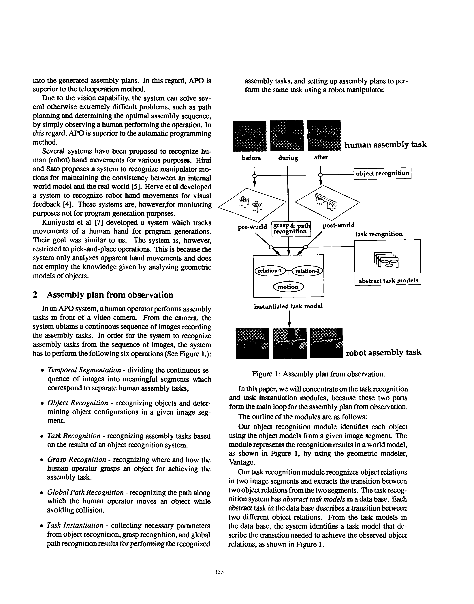
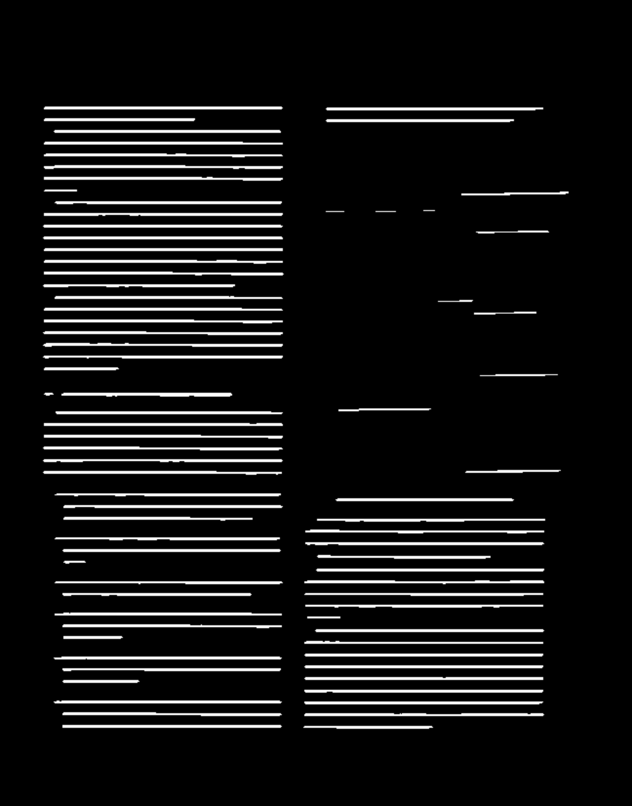

# OCR Segmentation
a deep learning model for page layout analysis / segmentation.

## dependencies
tensorflow1.8
> 
python3

## dataset:
[uw3-framed-lines-degraded-000](https://storage.googleapis.com/tmb-ocr/uw3-framed-lines-degraded-000.tgz)

## make training labels
    python3 data_pre_process.py

## train
    python3 train_test.py
## test
    python3 segmentation.py

## references
Multi-Dimensional Recurrent Neural Networks(https://arxiv.org/abs/0705.2011)
Robust_ Simple Page Segmentation Using Hybrid Convolutional MDLSTM Networks(https://github.com/wanghaisheng/awesome-ocr/files/2042377/Robust_.Simple.Page.Segmentation.Using.Hybrid.Convolutional.MDLSTM.Networks.pdf)
[https://github.com/NVlabs/ocroseg](https://github.com/NVlabs/ocroseg)
[https://github.com/philipperemy/tensorflow-multi-dimensional-lstm](https://github.com/philipperemy/tensorflow-multi-dimensional-lstm)

